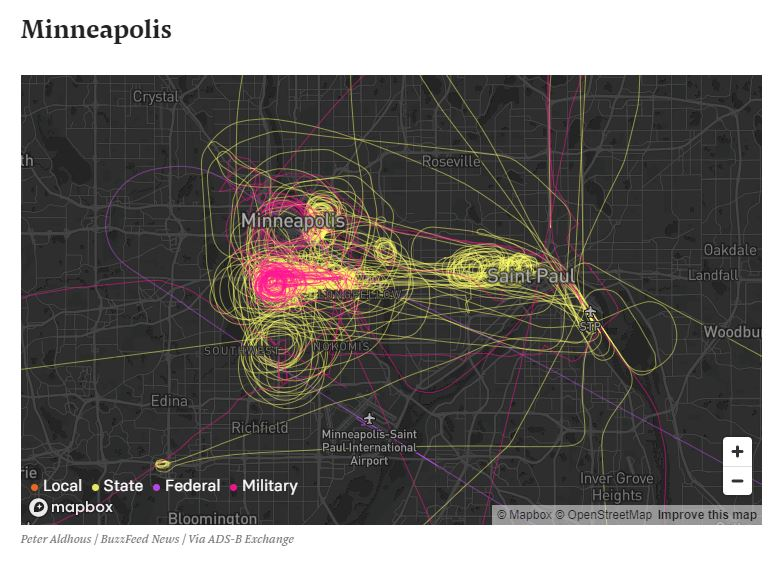
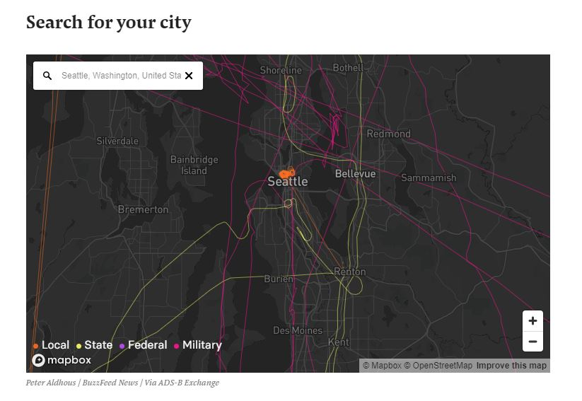
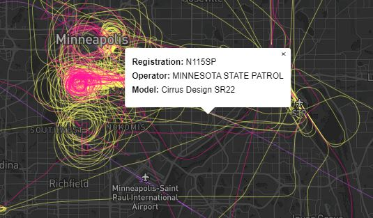
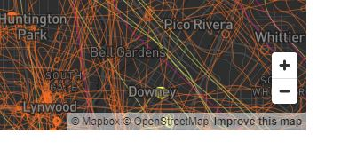
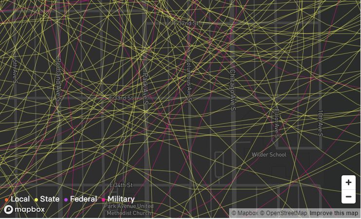

# [Surveillance Planes During Protests](https://www.buzzfeednews.com/article/peteraldhous/george-floyd-protests-police-military-planes)

Peter Aldhous developed the map that is going to be discussed in this project. The maps in the article written by Peter show the local, state, federal, and military plane surveillance during the civil unrest after George Floyd's murder in Minneapolis. The country erupted in protest, and the government had to act to ensure everyone's health and safety. These maps, made by Peter Aldhous, reflect the security level that was occurring during this time.
> Surveillance planes are always in action over the nation. To give an overview of the airborne response to the current civil unrest, we mapped flights by local police, state and federal law enforcement, and military planes from 7 p.m. Central Time on Friday, May 29, to 7 p.m. Central Time on Sunday, May 31. The locations of large demonstrations coincided with the most intense aircraft activity. Peter Aldhous

This data was collected soon after the initial protests occurred in the United States. The ability to distinguish between local, state, federal, and military planes gives a greater sense of who was involved and to what extent each branch of the government responded.
All the data that was collected for the creation of these maps was found from the [Federal Aviation Administration](https://www.faa.gov/licenses_certificates/aircraft_certification/aircraft_registry/releasable_aircraft_download/) , or FAA. The FAA keeps flight path records of every aircraft that is flying over US Airspace. While the FAA does not have flight tracking data, [ADS-B Exchange](https://www.adsbexchange.com/)  tracks physical tracks of aircraft without any filtering.
>ADS-B Exchange differs from typical flight tracking sites in two primary ways.
First and foremost, ADS-B Exchange does not participate in the filtering performed by most other flight tracking websites that do not share data on military or specific private aircraft. Because ADS-B Exchange does not use any FAA data, there are no FAA BARR/LADD, military, or other "filters" preventing you from seeing the data you collected.  ADS-B Exchange does not accept payment or requests to remove aircraft from public tracking!
Second, we are a community. The data we have comes from volunteers, which is supplied back to the community through APIs. Donations are appreciated as they are used to help cover the costs of the infrastructure, archive, and all of the great things you see when using our site.

The first map that is shown is the response to Minneapolis during the time window of 7:00 p.m. May 29 to 7:00 p.m. May 31. This map sets the scene of why this story is essential for people interested in the government response to civil unrest, aircraft tracking, and the communities' safety that live within these cities. Minneapolis had a considerable presence of surveillance occurring during this first weekend of protests.

## Map Design
The choice in basemap and thematic colors is very intentional. The reason is to draw the viewer into the map in a way that shocks or provokes a feeling. The dramatic contrast between the thematic colors and the dark basemap creates a sense of shock and awe. The dark base map has very little information besides roadways and towns. The reason for this is to show significant throughways and places of interest for officials and civilians. Within the map, three tools are being used: a search bar, popups, navigation, and zoom levels.

### Search Bar

The use of a search bar is interesting because it allows the viewer to find cities closely related to themselves. The viewers can search for any major city within the United States and find information related to their communities. This is powerful because instead of having a static map with limited information, the viewer can make their own decisions and observations.

### Popups

Popups are used to provide more information to the viewer. In this map, the popups are used to provide aircraft registration, operator, and model of aircraft. This is important to understand what types of surveillance were occurring and how moveable the aircraft was. A plane has a very different character than a helicopter in its ability to land, hover, and move through a city.

### Navigation

The only way to navigate the map is by using the zoom level toggle and dragging with your mouse or finger, depending on the viewer's device. These are standard ways of interacting with the map.

### Zoom Levels

Zoom levels are an essential aspect to map design because, depending on the author's decisions in how detailed they want to make the map, it changes the map's uses. This map has a very high level of detail when it comes to zoom levels. The viewer can zoom directly to the street level and find the paths above their homes or workplaces. This detailed level furthers the viewer's ability to find information about themselves and create their conclusions.

## Code
### Map Building Code
    mapboxgl.accessToken = 'pk.eyJ1IjoicGFsZGhvdXMtYmYiLCJhIjoiY2pvN25uY24zMHVzMjN3cHVvdW45enlnZCJ9.fkZVsl0uxcHs2Mw2_iHnJA';
      var map = new mapboxgl.Map({
          container: 'map',
          style: 'mapbox://styles/paldhous-bf/ckaymc39y0t9r1in23sheabuw',
          center: [-77.0387238,38.8976763],
          zoom: z,
          minZoom: 5
      });

The way that Peter Aldous is creating the map objects is through the Mapbox API.
### Popup Code
      map.on('click', function(e) {
        var features = map.queryRenderedFeatures(e.point, {
          layers: ['this-wkd-clzt2d']
        });

        if (!features.length) {
          return;
        }

        var feature = features[0];

        var popup = new mapboxgl.Popup({ offset: [0, -15] })
          .setLngLat(e.lngLat) // this is the position where the cursor clicked
          .setHTML('<b>Registration: </b>' + feature.properties.reg + ' <b>Operator: </b>' + feature.properties.name_edit +
          ' <b>Model: </b>' + feature.properties.model)
          .addTo(map);
      });
This code develops the onclick popups for the FAA data associated with the ADS-B flight path data.

## Analyze
This map does a lot of excellent things regarding the subject matter, the way the data is conveyed, and the level of detail within the data. However, the map does a lot of things poorly for the viewer. This map isn't a traditional webmap or smart dashboard, but it could be considered a story map. The map was posted on a popular website called "Buzzfeed." Buzzfeed has been known to create many outstanding and exciting visualizations that spark interest within a viewer. It is not a "normal" collection of maps like someone sees on ArcGIS or other hosting platforms. But, I do think that this is a benefit to this map overall. I think it is a benefit because it shows an observed phenomenon that most people wouldn't see in a typical news setting. Would it have been better to create this map in a smart dashboard or traditional webmap fashion? Maybe, but what it lacks in this department it makes up for in the ability for a lot of people to see this information.

Maps are developed to change a large group of people's perspectives and help them see the world through a different lens. This map does an outstanding job of creating a story out of the information that is being presented. While also allowing for self-discovery, within the viewer, in the aspects regarding where they live and how they were involved.

## Reflection on Course
These maps' collections bring a remarkable parallel to my interest in how all of the technologies in "Digital turn, digital geographies" by James Ash are used to change the paradigm within Geography. All of the technologies discussed are relevant to the forward progress of how we, as geographers, see the world and can change most individuals' perceptions of how the world works, looks, and interacts by looking at a phenomenon that does not naturally happen and to see the outcomes of that phenomenon. Ash talks about how "quantitative geographical analysis has become more closely aligned with data science. With the rise of spatial big data and new machine learning analytics (e.g., data mining and pattern recognition, geovisualization, spatial statistics, prediction, optimization, and simulation), there has been a renewed interest in developing what has been termed the computational social sciences." Even though this specific example does not relate to quantitative geographical analysis, it does relate to the changing mindset within geovisualization. We are looking at an issue that wasn't necessarily in the limelight and creating a visualization that makes these issues present.

Geovisualization has so many different ways to interpret data through maps. What's problematic about these interpretations in the data is that there are always biases associated with them, and its findings acknowledge these biases to change them for good. James Ash discusses, "We believe this is critically important because if we are to identify and meaningfully influence the effects and outcomes of digital technologies, then we must understand the nature and operationalization of technology infrastructures and protocols."

Much like in "Affective Geovisualisations" by Stuart Aitken and James Craine. This article mainly suggests the importance of how impactful geovisualizations are for man-kind and how this study has come about. Aitken and Caine use the parallel of how Sergei Eisenstein changed film with the notion of 'the-image-in-motion-over-time-through-space-with-sequence.' This paradigm shift in the movie is much like how DiBiase's changed the way we look at geography and the creation of maps. Maps tell stories and are integral to the expansion of power, people, and goods. Without maps, we would not understand what the world looks like or how different territories interact. Geovisualization is essential in the understanding of many types of phenomena and should be studied at greater length.
In conclusion, geovisualization is a significant component of developing useful maps, especially regarding creating a map that has never been seen before. Peter Aldous has accomplished this through his mapping techniques and decisions. Some of the main methods he has used contrast to create dramatic governmental surveillance imagery during a time of civil distress. When a viewer interacts with these maps, they can understand the level of surveillance without any issue.
